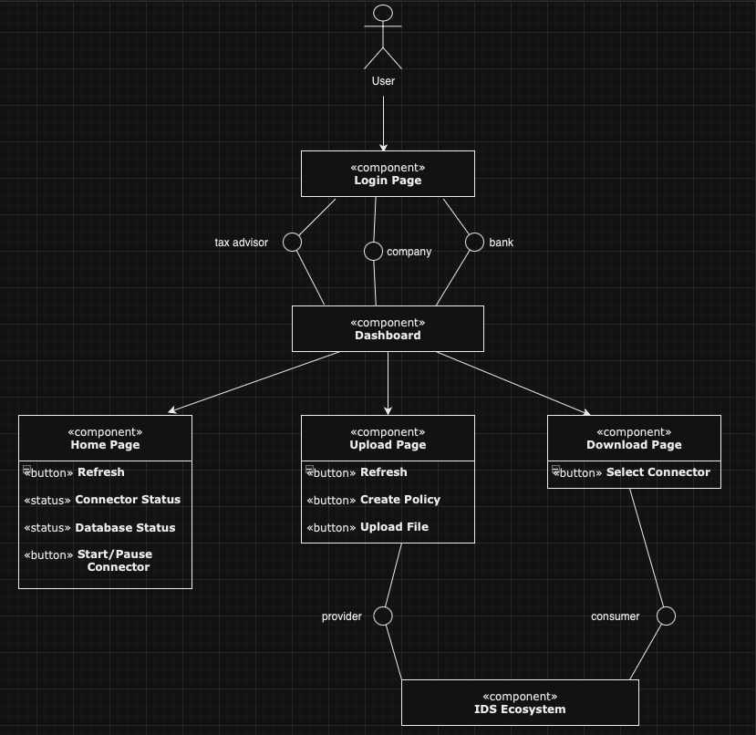

## Introduction
With the rise in data exchange among sectors such as finance, legal, and government, there is a growing need for seamless data interoperability while ensuring compliance with data usage policies and local regulations. Dataspace aims to address these challenges by creating a secure and efficient environment for data sharing.

This project investigates the feasibility of utilizing dataspaces with a focus on data sovereignty. It involves evaluating the maturity of dataspaces, identifying crucial components, and assessing the ease of deployment. The ultimate objective is to facilitate secure and compliant data sharing among diverse entities.

## Component Diagramm

## Components
### 1. Login Interface

The Login Interface serves as the initial access point to the system, facilitating authentication for users. The primary purpose of the Login Interface is to authenticate users and grant access to the system based on their roles: bank, tax advisor, or company. Each of the roles is provided with a unique url, through which they can only login in for their roles and not the other ones.

### 2. Data Connectors
Data connectors are the core components that enable secure and effective communication and data exchange between different entities. They facilitate the connection of multiple data endpoints, increasing the pool of available data and accelerating the data economy.

Each data connector performs the following functions:
- **Connectivity Validation**: Ensures secure connection establishment with data sources or destinations.
- **Data Exchange**: Manages secure data transfer, including encryption and decryption processes.
- **Compliance Monitoring**: Ensures adherence to data usage policies and local regulations during data exchange.
- **Audit Logging**: Maintains transaction logs for transparency and accountability.

### 3. Dashboard Interface
The Dashboard Interface serves as the central hub for users post-authentication, offering a comprehensive overview of available functionalities and navigation options within the system.

#### Dashboard Components

a. **Home Interface**: The default landing page accessible from the Dashboard Interface, providing users with an overview of their connector status and relevant information. The following elements are visible at the Home Interface:
- *button* **Refresh**: used to refresh the information about the statuses of the connector and the database
- *status* **Connector Status**: shows whether the connector for the selected role is running or not (is either shown in green or red)
- *status* **Database Status**: shows whether the database for the selected role is running or not (is either shown in green or red)
- *button* **Start/Pause Connector**: enables to either start or pause the connector for the logged in user

b. **Upload Interface**: A dedicated page enabling users to upload files to the database, that will later be visible to the other connectors.
- *button* **Refresh**: used to refresh the information about the currently uploaded files
- *button* **Upload File**: allows the user to upload a chosen file from their computer. Requires to choose a title and policy for the chosen file
- *button* **Create Policy**: allows the user to create a new policy

c. **Download Interface**: A dedicated page enabling the users to download files that where uploaded by the other users.
- *Dropbox* **Select connector**: allows the users to choose the connector from whom they want to download the file.
- *Table*: a table containing all the accessible files from the chosen connector.
    - *button* **Negotiate**: a button next to the files visible in the table that allows the negotiation of the contract to download the chose file

### 4. Backend Services
The backend services handle the core logic of the dataspace application, managing connections, data exchanges, and compliance monitoring.

#### Components
1. **Connection Manager**:
    - **Functionality**: Manages the establishment, maintenance, and termination of connections between data connectors.
    - **Security**: Ensures secure connections using encryption protocols.

2. **Data Exchange Manager**:
    - **Functionality**: Oversees the secure transfer of data between entities.
    - **Compliance**: Ensures data exchanges adhere to predefined rules and regulations.

3. **Compliance Monitor**:
    - **Functionality**: Monitors all data exchanges to ensure compliance with data usage policies and local regulations.
    - **Reporting**: Generates reports on compliance status and any detected violations.

4. **Audit Logger**:
    - **Functionality**: Maintains detailed logs of all transactions and data exchanges.
    - **Transparency**: Provides an audit trail for transparency and accountability.

## Conclusion
The IDS aim to explore the practical implementation of dataspace technology in ensuring secure and compliant data exchange across different sectors. The project focuses on demonstrating the viability of dataspace as a solution for modern data interoperability challenges, with a strong emphasis on data sovereignty, transparency, and fairness. Through this documentation, the design and components of the Dataspace application are detailed to provide a clear understanding of its structure and functionalities.