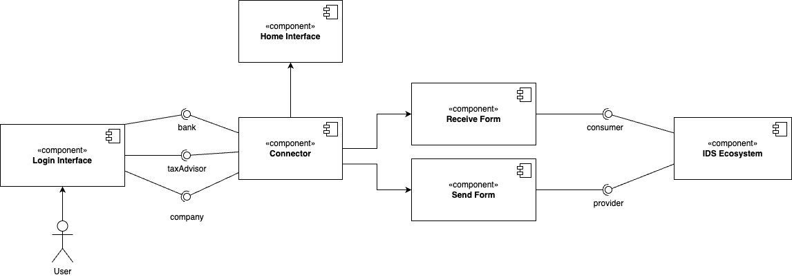

# Design Documentation

## Introduction
With the rise in data exchange among sectors such as finance, legal, healthcare, and government, there is a growing need for seamless data interoperability while ensuring compliance with data usage policies and local regulations. Dataspace aims to address these challenges by creating a secure and efficient environment for data sharing.

This project investigates the feasibility of utilizing dataspaces with a focus on data sovereignty. It involves evaluating the maturity of dataspaces, identifying crucial components, and assessing the ease of deployment. The ultimate objective is to facilitate secure and compliant data sharing among diverse entities.

## Component Diagram

## Components
### 1. Login Interface

The Login Interface serves as the initial access point to the system, facilitating authentication for users. The primary purpose of the Login Interface is to authenticate users and grant access to the system based on their roles: bank, tax advisor, or company.

##### Components

a. **Username Field**: This input field prompts users to enter their username or registered email address.

b. **Password Field**: Users are required to input their password securely in this field.

c. **Login Button**: This button initiates the authentication process upon user input of credentials and role selection.

### 2. Data Connectors
Data connectors are the core components that enable secure and effective communication and data exchange between different entities. They facilitate the connection of multiple data endpoints, increasing the pool of available data and accelerating the data economy.

Each data connector performs the following functions:
1. **Connectivity Validation**: Ensures secure connection establishment with data sources or destinations.
2. **Data Exchange**: Manages secure data transfer, including encryption and decryption processes.
3. **Compliance Monitoring**: Ensures adherence to data usage policies and local regulations during data exchange.
4. **Audit Logging**: Maintains transaction logs for transparency and accountability.

### 3. Dashboard Interface
The Dashboard Interface serves as the central hub for users post-authentication, offering a comprehensive overview of available functionalities and navigation options within the system.
#### Components

a. **Home Interface**: The default landing page accessible from the Dashboard Interface, providing users with an overview of their connector status and relevant information.

b. **Receive Interface**: A dedicated page or section enabling users to see any received data from other connectors.

c. **Send Interface**: A designated area allowing users to initiate an outgoing data flow.

### 4. Backend Services
The backend services handle the core logic of the dataspace application, managing connections, data exchanges, and compliance monitoring.

#### Components (to be implemented)
1. **Connection Manager**:
   - **Functionality**: Manages the establishment, maintenance, and termination of connections between data connectors.
   - **Security**: Ensures secure connections using encryption protocols.

2. **Data Exchange Manager**:
   - **Functionality**: Oversees the secure transfer of data between entities.
   - **Compliance**: Ensures data exchanges adhere to predefined rules and regulations.

3. **Compliance Monitor**:
   - **Functionality**: Monitors all data exchanges to ensure compliance with data usage policies and local regulations.
   - **Reporting**: Generates reports on compliance status and any detected violations.

4. **Audit Logger**:
   - **Functionality**: Maintains detailed logs of all transactions and data exchanges.
   - **Transparency**: Provides an audit trail for transparency and accountability.

## Conclusion
The IDS aims to explore the practical implementation of dataspace technology in ensuring secure and compliant data exchange across different sectors. The project focuses on demonstrating the viability of dataspace as a solution for modern data interoperability challenges, with a strong emphasis on data sovereignty, transparency, and fairness. Through this documentation, the design and components of the Dataspace application are detailed to provide a clear understanding of its structure and functionalities.
